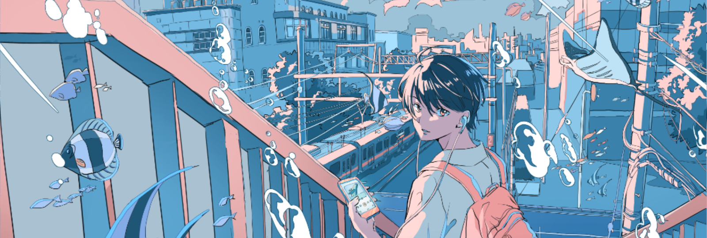

 
Hello there 👋, nice of you to drop by ... My name is shubham, I seem to be having a critical case of an overly-active imagination, and apparently, a lot of ideas take shape inside this little head of mine.
On this github page, I am trying to realise as many of them as humanly possible, before I die. Join me while I learn, give up, get back up and continue moving.
<h3 align="center";>" 𝙵𝙰𝙸𝙻 𝙵𝙰𝚂𝚃, 𝙵𝙰𝙸𝙻 𝙵𝙾𝚁𝚆𝙰𝚁𝙳 🚀 " </h3> 

<!-- Let's team up, collaborate, and bring ideas to life! Reach out, and let's embark on a thrilling journey together. -->

<!-- stack -->
<h1 align="center";> 

STACK 
</h2>
<!--  -->
<!--  -->
<!--  -->
  
<h2 align="center";> 🦹 Programming Languages:  
  
    

🪤 Tools & Technologies: 
             

🧬 Version Control & Collaboration:  
  </h2>

<!-- stats -->
<h1 align="center"> 
GITHUB STATS 
 </h1>

  
  

  
  

<!-- trophies -->
<h1 align="center";> 
 
  GitHub Trophies 

   
</h1>

<!-- quote -->
<h1 align="center">  DEV QUOTE 

 </h1>

<!-- meme -->
<h1 align="center">  
  DEV MEME
  
  </h1>

<!--  -->
