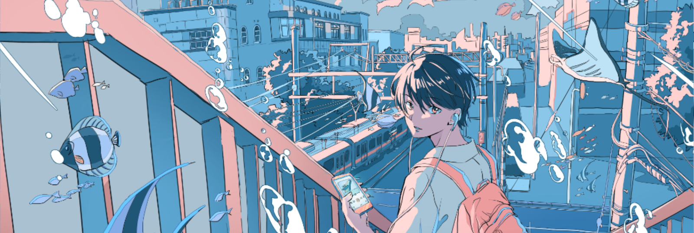

<h3 align="center";>" 𝙵𝙰𝙸𝙻 𝙵𝙰𝚂𝚃, 𝙵𝙰𝙸𝙻 𝙵𝙾𝚁𝚆𝙰𝚁𝙳 🚀 " </h3> 

<!-- stats -->
<h1 align="center"> 
GITHUB STATS 
 </h1>
<!--  -->

  
  
<!--    -->

  

<!-- trophies -->
<!-- <h1 align="center";> 

GitHub Trophies  -->
<!--  -->

  <!--  
</h1> -->

<!--  -->
