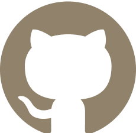

<h3 align="center";>" 𝙵𝙰𝙸𝙻 𝙵𝙰𝚂𝚃, 𝙵𝙰𝙸𝙻 𝙵𝙾𝚁𝚆𝙰𝚁𝙳 🚀 " </h3> 

<!-- Let's team up, collaborate, and bring ideas to life! Reach out, and let's embark on a thrilling journey together. -->

<!-- stack -->
<h1 align="center";> 

STACK 
</h2>
<!--  -->
<!--  -->
<!--  -->
  
<h2 align="center";> <!-- 🦹 Programming Languages:   -->
 

 

<!-- 🪤 Tools & Technologies:  -->

 

<!-- 🧬 Version Control & Collaboration:   -->

</h2>

<!-- stats -->
<h1 align="center"> 
GITHUB STATS 
 </h1>
<!--  -->

  
  
  

  
  

<!-- trophies -->
<h1 align="center";> 
 
  GitHub Trophies 

   
</h1>

<!--  -->
